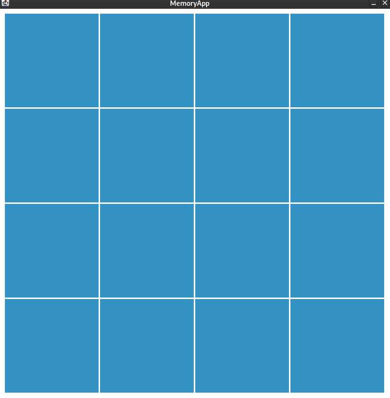
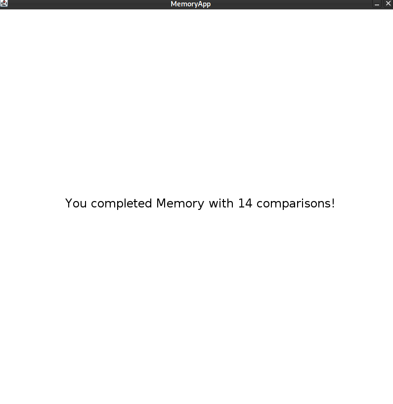

# U31-MemoryGame

Im Rahmen dieser Aufgabe implementieren Sie das bekannte Spiel Memory.

{ width=50% }

Wie auf dem obigen Bild dargestellt, beinhaltet das Memoryspiel dieser Aufgabe 16 Karten, die auf vier Reihen a vier Karten aufgeteilt werden.
Zu Beginn jedes Spiels die Karten per Zufall verteilt. 
Per Mausklick wird eine Karte aufgedeckt.
Sind zwei Karten aufgedeckt, soll überprüft werden, ob deren Bilder zusammenpassen.
Passen sie zusammen, verschwinden die Karten.
Ansonsten bleiben sie so lange aufgedeckt bis sie durch erneutes Klicken wieder umgedreht werden.
Am Ende des Spiels soll angezeigt werden, wie oft zwei Karten verglichen wurden.

 { width=50% }  

Alle benötigten Bilder befinden sich im Ordner `data/assets`, der im Starterpaket enthalten ist.

Folgende Anforderungen muss das Memoryspiel für diese Aufgabe erfüllen:

* Die Klasse `MemoryApp` muss als Einstiegspunkt für Ihr Memoryspiel verwendet werden
* Teilen Sie Ihre Anwendung in sinnvolle Komponenten ein und legen Sie entsprechende Klassen dafür an
* Trennen Sie die Daten von Objekten (z.B. Karten) von deren Darstellung
* Verwenden Sie die Klasse `java.io.File` 
  * `File[] files = new File(PATH_TO_ASSETS).listFiles()`, um ein `Array' zu erhalten, dass alle darin befindlichen Dateien enthält
  * Verwenden Sie die Methode `getAbsolutePath()`, um den absoluten Pfad einer Datei zu bekommen die als `java.io.File` Objekt vorliegt
